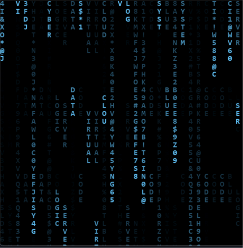

# 🌧️ Chuva Digital Azul - Efeito Hacker

Bem-vindo ao código do projeto Chuva Digital! 🌧️ Este é um projeto de Codificação Criativa focado em recriar a clássica animação de terminal estilo "Matrix", mas com uma paleta de cores azul cyberpunk e um toque especial na geração dos textos.

## 🚀 Sobre o Projeto

Um script visual contínuo construído inteiramente em Python utilizando a biblioteca Pygame para desenhar e animar caracteres na tela[cite: 25]. O projeto simula um fluxo de dados criptografado caindo, criando o icônico efeito visual de rastros brilhantes que somem gradualmente, misturando símbolos aleatórios com jargões tecnológicos[cite: 25].

## ✨ Funcionalidades Principais

* **Efeito de Rastro (Fade):** O código usa uma técnica inteligente criando uma superfície preta semi-transparente (`set_alpha(15)`) que é desenhada a cada quadro. Isso faz com que as letras deixem um rastro suave que se apaga gradualmente, simulando o brilho residual de monitores antigos[cite: 25].
* **Palavras Ocultas (Easter Eggs):** Em vez de apenas letras sem sentido, o script decide aleatoriamente (`random.random() > 0.4`) se uma coluna vai desenhar símbolos soltos ou soletrar palavras na vertical, como "SYSTEM", "CYBER", "NETWORK" e "CLOUD"[cite: 25].
* **Estética Cyberpunk:** Usa a fonte monoespaçada "Consolas" em negrito com uma coloração azul luminosa `(100, 200, 255)` sobre um fundo preto absoluto[cite: 25].
* **Geração Orgânica Infinta:** A tela é calculada e dividida em colunas baseadas no tamanho da fonte (`FONT_SIZE = 16`). Cada gota possui posições iniciais em Y negativas e imprevisíveis, e elas se reiniciam automaticamente quando saem da tela, mantendo a chuva densa e contínua[cite: 25].

## 🛠️ Tecnologias Utilizadas

* **Python:** Linguagem de programação principal estruturando a lógica de listas, laços e variáveis dinâmicas[cite: 25].
* **Pygame:** Biblioteca gráfica nativa do ecossistema Python utilizada para a criação da janela (`pygame.display`), renderização rápida de textos (`pygame.font`), e controle de quadros por segundo (`clock.tick(15)`)[cite: 25].
* **Biblioteca Random:** Módulo embutido utilizado extensivamente para dar o caos necessário ao efeito, sorteando caracteres (`random.choice(CHARS)`), escolhendo palavras e determinando o reinício das gotas[cite: 25].

## 📂 Estrutura de Arquivos

* `chuva_digital.py` (ou `script.py`) - O arquivo principal contendo todo o script Python e a lógica do Pygame.
* `Raind.png` - Imagem de demonstração (preview) deste README.

## 🚀 Como Executar

1. Certifique-se de ter o Python instalado na sua máquina.
2. É necessário instalar a biblioteca Pygame. Abra o terminal ou prompt de comando e digite: `pip install pygame`
3. Faça o download ou clone este repositório.
4. Execute o script com o comando: `python chuva_digital.py` (substitua pelo nome real do seu arquivo).
5. Aprecie o fluxo de dados na sua tela! Para sair, basta fechar a janela do programa.
