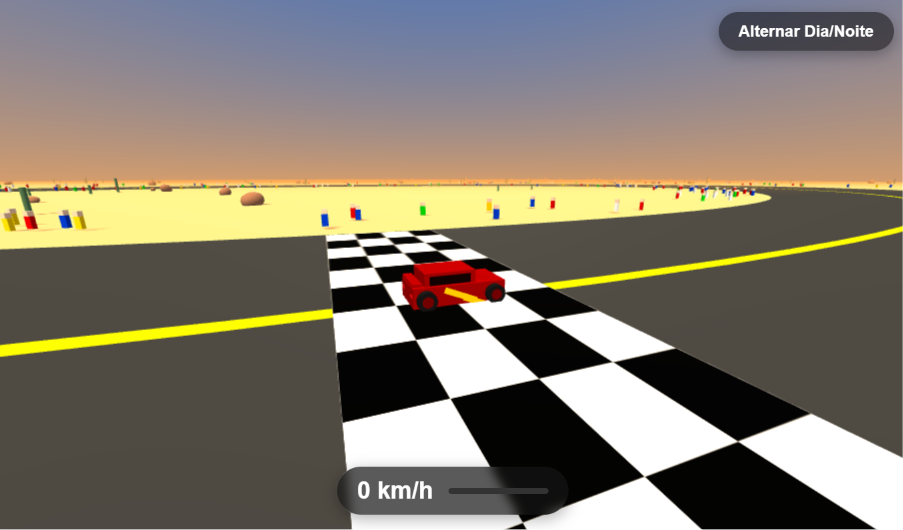

# 🏎️ Jogo de Corrida Oval 3D

Bem-vindo ao código do jogo de Corrida Oval 3D! 🏎️ Este é um projeto de simulação gráfica construído inteiramente no navegador para criar uma experiência de corrida vibrante com iluminação dinâmica, inteligência artificial básica de corredores e controles de física customizados[cite: 21, 22].

## 🚀 Sobre o Projeto

Um simulador de corrida contínuo desenvolvido do zero, combinando manipulação avançada da biblioteca `three.js` para renderização WebGL e geometria vetorial no JavaScript[cite: 21, 22]. O destaque deste projeto está no sistema manual de construção de veículos (carrocerias formadas por composição de objetos 3D), controles orbitais customizados atrelados ao veículo do jogador, e um ciclo visual de Transição Dia/Noite com iluminação em tempo real[cite: 22].

## ✨ Funcionalidades Principais

*   **Renderização 3D Imersiva:** Uso extensivo do `three.js`, incluindo `PerspectiveCamera`, texturas e luzes embutidas para gerar cenários complexos com sombras ativadas (PCFSoftShadowMap)[cite: 22].
*   **Transição Dinâmica Dia/Noite:** Botão interativo que altera as propriedades atmosféricas. Uma função anima o gradiente da abóbada celeste (`skyDome`), recalcula as cores da neblina (`Fog`) e a intensidade do Sol e luzes de preenchimento (`AmbientLight`, `DirectionalLight`) de forma suave usando interpolação `lerp`[cite: 22].
*   **Controle e Física do Veículo:** O carro do jogador é governado por cálculos manuais de aceleração e frenagem combinados com forças de inércia e atrito (`friction: 0.98`), o que confere uma dirigibilidade desafiadora com deslizamento em curvas[cite: 22].
*   **Modelagem 3D via Código:** Elementos do cenário, como carros, cactos e a placa "ROUTE 66", são compostos através da combinação de geometrias simples (`CylinderGeometry`, `BoxGeometry`, `DodecahedronGeometry`), e aplicação de texturas e materiais com diferentes reações luminosas (`MeshStandardMaterial`, `MeshPhysicalMaterial`)[cite: 22].
*   **Inteligência Artificial (Bots):** Além do carro do jogador, corredores autônomos transitam na pista, utilizando ângulos polares e cálculo orbital (`angularSpeed`, `laneOffset`) para se manterem no percurso perfeitamente em velocidades distintas[cite: 22].
*   **Painel Dinâmico e Controle de Visão:** Integração com o DOM para projetar um velocímetro (`speed-fill`) em tempo real no rodapé, associado ao arraste (`Drag`) livre de câmera que permite a visualização em 360º ao redor do veículo em movimento[cite: 22, 23].

## 🛠️ Tecnologias Utilizadas

*   **HTML5 & CSS3:** Utilizados para o HUD (Heads-Up Display) superposto à tela da renderização 3D. Estilização baseada em `backdrop-filter: blur` para elementos visuais translúcidos, como o velocímetro e botões[cite: 21, 23].
*   **JavaScript & three.js:** A linguagem central controla as propriedades do cenário, enquanto a API embutida (através do pacote r128 do `three.min.js`) abstrai as chamadas ao WebGL[cite: 21, 22].

## 📂 Estrutura de Arquivos

*   `index.html` - Container para as interfaces web HTML e script importado da WebGL[cite: 21].
*   `style.css` - A interface estilística do overlay visual[cite: 23].
*   `script.js` - O motor embutido principal contendo as matrizes do cenário 3D e render loops[cite: 22].
*   `Car.png` - Imagem de demonstração do README.

## 🚀 Como Executar

1.  Faça o download ou clone este repositório.
2.  Dê um duplo clique no arquivo `index.html` para abri-lo em qualquer navegador web moderno.
3.  Utilize `W`, `A`, `S`, `D` ou as setas do teclado para pilotar, arraste o mouse na tela e divirta-se!
