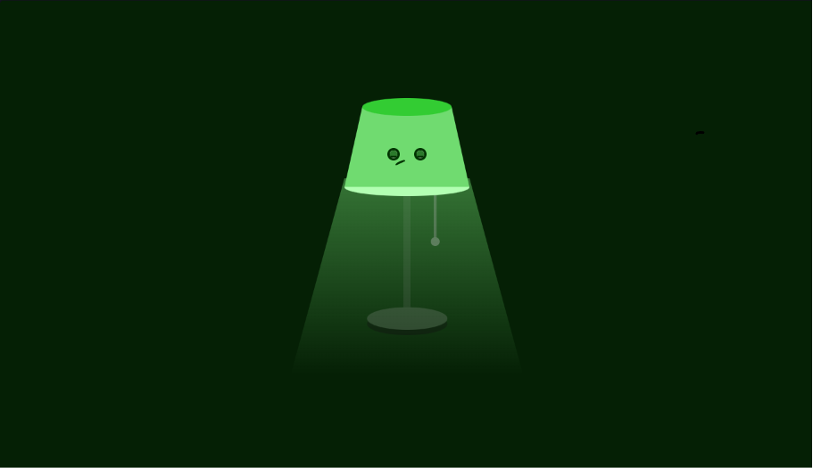

# 💡 Lâmpada das Emoções - Divertida Mente

Bem-vindo ao código do projeto da Lâmpada das Emoções! 💡 Este é um projeto de Codificação Criativa focado em criar uma luminária interativa e divertida que muda de humor, cor e expressão a cada puxão de cordinha.

## 🚀 Sobre o Projeto

Um projeto interativo construído do zero, combinando manipulação de DOM via JavaScript com técnicas avançadas de desenho e animação em CSS[cite: 4, 5, 6]. O grande destaque deste código é como ele utiliza seletores de atributos de dados (`data-emotion`) combinados com variáveis CSS para transformar completamente a atmosfera do ambiente e o "rosto" do personagem sem precisar recarregar a página[cite: 5, 6].

## ✨ Funcionalidades Principais

* **Interatividade de Interruptor:** Um clique na cordinha da lâmpada aciona o JavaScript para avançar para a próxima emoção em um ciclo contínuo[cite: 5].
* **Dez Estados Emocionais:** A lâmpada possui personalidades únicas: Desligada (Dormindo), Alegria, Raiva, Nojinho, Tristeza, Ansiedade, Apaixonada, Chorando, Sapeca e Palhaço[cite: 5].
* **Controle Global por Variáveis CSS:** As cores do ambiente (fundo da sala), a opacidade/cor da luz projetada e as cores da base da lâmpada mudam de forma super fluida usando propriedades customizadas do CSS (`--bg-room`, `--light-color`, etc.)[cite: 6].
* **CSS Drawing Avançado:** As expressões faciais (formatos dos olhos, bocas, lágrimas e bochechas coradas) foram construídas puramente com CSS, fazendo uso inteligente de `border-radius`, polígonos com `clip-path` e pseudo-elementos (`::before` e `::after`)[cite: 6].
* **Animações (Keyframes):** Detalhes dinâmicos dependendo do humor, como o texto "Zzz" flutuando quando desligada, corações pulsando (apaixonada) e animações de choro com lágrimas escorrendo[cite: 6].

## 🛠️ Tecnologias Utilizadas

* **HTML5:** Estruturação semântica do personagem e do ambiente[cite: 4].
* **CSS3:** Variáveis nativas, transições suaves (`transition`), animações em keyframes (`@keyframes`), gradientes e manipulação geométrica (`clip-path`)[cite: 6].
* **JavaScript puro:** Lógica simples de array e escuta de eventos (`addEventListener`) para alternar os estados emocionais da sala (`data-emotion`)[cite: 5].

## 📂 Estrutura de Arquivos

* `index.html` - A estrutura principal da página e elementos da lâmpada.
* `style.css` - Contém todas as variáveis, desenhos faciais e animações do projeto.
* `script.js` - O motor que controla a troca de emoções ao puxar a cordinha.
* `Captura de tela 2026-08-06 090354.png` - Imagem de demonstração do README.

## 🚀 Como Executar

1. Faça o download ou clone este repositório.
2. Certifique-se de que todos os arquivos estejam na mesma pasta.
3. Dê um duplo clique no arquivo `index.html` para abri-lo em qualquer navegador web moderno.
4. Clique na cordinha da lâmpada para ligá-la e começar a descobrir as emoções!
