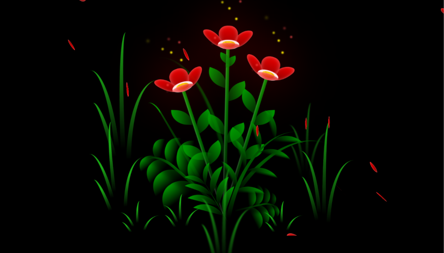

# 🌷 Flores Animadas em CSS - CSS Art & Animation

Bem-vindo ao código do projeto de Flores Animadas! 🌷 Este é um projeto fascinante de Codificação Criativa (Creative Coding) focado em construir um cenário noturno, relaxante e orgânico usando puramente o poder do CSS.

## 🚀 Sobre o Projeto

Uma verdadeira obra de arte em código, este projeto não utiliza o elemento Canvas e nem imagens externas (SVGs, PNGs)[cite: 13, 14, 15]. Toda a estrutura visual (flores, grama, luzes e pétalas) é gerada através do HTML e estilizada e animada com propriedades avançadas de CSS3[cite: 13, 14, 15]. O JavaScript atua apenas como um gatilho de tempo para iniciar o desabrochar perfeito da cena[cite: 16].

## ✨ Funcionalidades Principais

* **CSS Art (Desenho Estrutural):** Cada detalhe da cena (caule, folhas, pétalas) é moldado geometricamente usando `border-radius` assimétricos, `clip-path` e sobreposição rica de degradês (`linear-gradient`)[cite: 13, 14].
* **Gatilho de Crescimento (Delay Animation):** Ao abrir a página, a classe `.not-loaded` paralisa a cena[cite: 13, 15]. Após 1 segundo, ela é removida, desencadeando uma sequência visual de crescimento, onde a grama e as flores desabrocham progressivamente[cite: 16].
* **Física e Vento (Keyframes 3D):** Utilização massiva de animações contínuas (`@keyframes`) e rotações tridimensionais (`rotateX`, `rotateY`, `rotateZ`) para criar um efeito orgânico da planta balançando ao vento[cite: 13, 14].
* **Chuva de Pétalas Infinita:** Um contêiner de pétalas caindo (`falling-petals`) onde cada folha tem atrasos (`animation-delay`), durações e escalas independentes, gerando uma chuva infinita natural[cite: 13, 14, 15].
* **Luzes e Atmosfera:** Partículas flutuantes e sombras na grama criadas com efeitos de `filter: blur()`, `box-shadow` e máscaras de preenchimento (`mask-image`)[cite: 13, 14].

## 🛠️ Tecnologias Utilizadas

* **HTML5:** Criação de um "esqueleto" profundo e detalhado de elementos `
` para separar logicamente as camadas geométricas da grama, flores e partículas[cite: 15].
* **CSS3:** O verdadeiro motor do projeto. Faz uso avançado de variáveis nativas (`--fl-speed`, `--dark-color`), perspectivas 3D e manipulações complexas em `@keyframes` para vida e movimento[cite: 13, 14].
* **JavaScript (Vanilla):** Um script minimalista composto por um `setTimeout` que limpa a paralisação do CSS e dá início ao espetáculo logo após a página ser carregada[cite: 16].

## 📂 Estrutura de Arquivos

* `index.html` - A estrutura esquelética das plantas e da cena noturna.
* `style.css` - Contém toda a mágica visual, o CSS Art e as lógicas de animação.
* `main.js` - O gatilho temporal responsável por soltar a reprodução das animações.
* `flower.png` - Imagem de demonstração (preview) deste README.

## 🚀 Como Executar

1. Faça o download ou clone este repositório.
2. Certifique-se de que todos os arquivos estejam na mesma pasta.
3. Dê um duplo clique no arquivo `index.html` para abri-lo em qualquer navegador web moderno.
4. Aguarde 1 segundo e aprecie o espetáculo do desabrochar das flores na sua tela!
