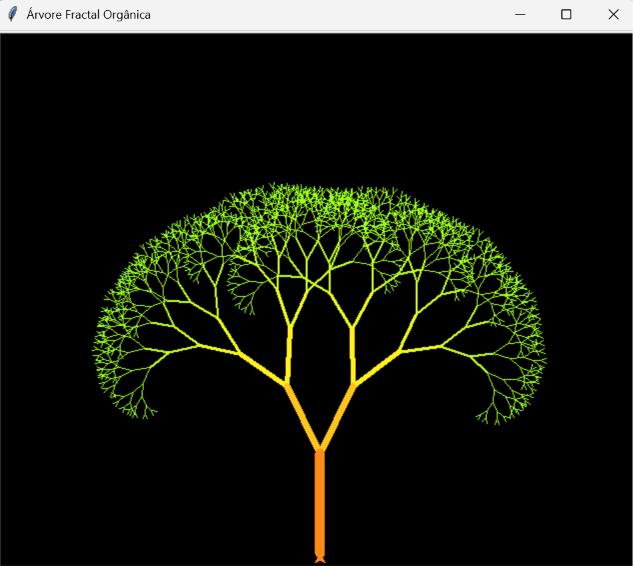

# 🌳 Árvore Fractal Orgânica - Turtle Graphics

Bem-vindo ao código do projeto Árvore Fractal Orgânica! 🌳 Este é um projeto de Codificação Criativa utilizando Python puro para gerar arte generativa, simulando o crescimento natural de uma árvore através de recursão matemática.

## 🚀 Sobre o Projeto

Um script visual construído com a biblioteca gráfica `turtle` do Python[cite: 29]. O projeto desenha uma ramificação fractal que se assemelha a uma árvore, onde cada galho se divide em sub-galhos menores, mudando dinamicamente de espessura e cor ao longo do processo para imitar a natureza[cite: 29].

## ✨ Funcionalidades Principais

* **Matemática Recursiva:** O coração do projeto é a função `draw_tree`, que chama a si mesma duas vezes a cada iteração para criar as bifurcações dos galhos, parando apenas quando o comprimento atinge o limite mínimo estipulado (`branch_len < 5`)[cite: 29].
* **Crescimento Orgânico (Caos Controlado):** Diferente de fractais rígidos e perfeitamente simétricos, os ângulos de abertura dos galhos recebem um toque de aleatoriedade (`random.uniform(20, 30)`), deixando a árvore com um aspecto muito mais natural e único a cada execução[cite: 29].
* **Degradê de Cores Dinâmico:** Utilizando o módulo `colorsys`, a cor de cada galho é calculada com base no seu comprimento atual. O mapeamento HSV para RGB faz com que o tronco mais grosso seja desenhado em tons de laranja/marrom e vá transicionando perfeitamente para um verde vibrante nas pontas[cite: 29].
* **Ajuste de Espessura:** Para reforçar o realismo da estrutura fractal, a espessura da caneta (`pensize`) afina progressivamente a cada nova ramificação (`pen_size * 0.7`)[cite: 29].
* **Otimização de Renderização:** O código utiliza o comando `tracer(2)` para acelerar a renderização da janela gráfica, permitindo que a árvore se forme rapidamente sem atrasos visuais pesados[cite: 29].

## 🛠️ Tecnologias Utilizadas

* **Python:** Linguagem de programação central estruturando a lógica e a recursão[cite: 29].
* **Turtle Graphics:** Biblioteca nativa do Python utilizada para instanciar a tela com fundo preto (`bgcolor('black')`) e gerenciar o pincel de desenho virtual[cite: 29].
* **Módulos Nativos:** Uso das bibliotecas embutidas `colorsys` (para conversão do modelo de cor HSV para RGB) e `random` (para geração de ângulos orgânicos)[cite: 29].

## 📂 Estrutura de Arquivos

* `main.py` - O arquivo principal contendo toda a lógica de recursão e o loop de desenho do Turtle.
* `Fractal.png` - Imagem de demonstração (preview) deste README.

## 🚀 Como Executar

1. Certifique-se de ter o **Python** instalado no seu computador. (O módulo `turtle` e os demais utilizados já vêm embutidos por padrão).
2. Faça o download ou clone este repositório.
3. Abra o terminal ou prompt de comando na pasta do arquivo.
4. Execute o script com o comando: `python main.py` (ou o nome que você deu ao seu arquivo `.py`).
5. Observe a árvore crescer e se ramificar na sua tela!
