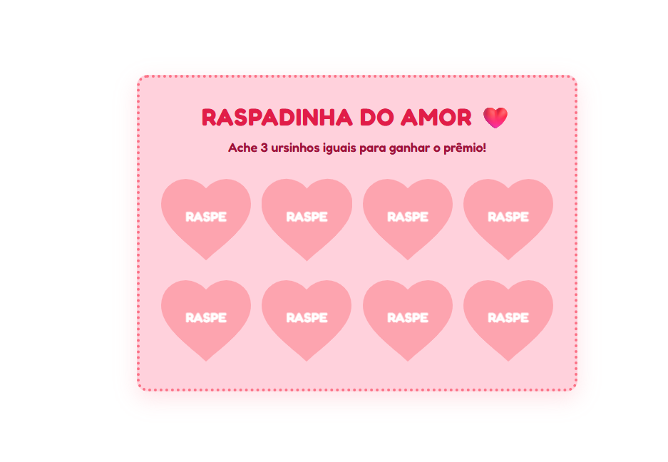
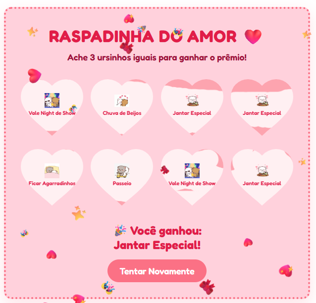

# Raspadinha do Amor ❤️

Um projeto web interativo e romântico, perfeito para criar um "Vale Presente" digital e surpreender quem você ama. O objetivo do jogo é simples: ache 3 ursinhos iguais para ganhar o prêmio![cite: 1]

## 📸 Demonstração

Veja como o projeto funciona na prática:

*Tela inicial com as 8 opções para raspar.*

*Tela de vitória com o prêmio revelado e chuva de confetes.*

## ✨ Funcionalidades

*   **Design Romântico:** Interface elegante com paleta de cores em tons pastéis e uso da fonte "Fredoka" para um visual moderno e fofo[cite: 3].
*   **Formato de Coração:** Os blocos da raspadinha utilizam máscaras SVG para manter o formato perfeito de coração enquanto escondem os prêmios[cite: 3].
*   **Interação Realista:** O usuário usa o mouse (com um cursor personalizado) ou o toque na tela para "raspar" a camada superior, revelando o conteúdo abaixo[cite: 2, 3].
*   **Sistema de Sorteio:** O código embaralha e posiciona prêmios como "Jantar Especial", "Vale Massagem", "Sessão Cinema", entre outros[cite: 2].
*   **Animação de Vitória:** Quando todos os blocos são raspados e o trio vencedor é encontrado, uma chuva de confetes e emojis (❤️, 🎉, ✨) toma conta da tela[cite: 2].

## 🛠️ Tecnologias Utilizadas

O projeto foi construído utilizando as seguintes tecnologias web clássicas:

*   **HTML5:** Estruturação da cartela e dos elementos do jogo[cite: 1].
*   **CSS3:** Estilização responsiva, aplicação de máscaras (clip-path/mask-image) e animações contínuas[cite: 3].
*   **JavaScript (Vanilla):** Lógica de embaralhamento dos prêmios, cálculo de área raspada no `<canvas>` e gatilho de eventos de vitória[cite: 2].

## 🚀 Como usar e personalizar

1. Faça o download ou clone este repositório.
2. Certifique-se de que os três arquivos principais (`index.html`, `style.css` e `script.js`) estão na mesma pasta[cite: 1].
3. Adicione os seus próprios arquivos `.gif` de ursinhos (ou outras imagens de sua preferência) na raiz do projeto, respeitando os nomes listados no `script.js` (ex: `ursomassagem.gif`, `ursojantar.gif`)[cite: 2].
4. Abra o arquivo `index.html` em qualquer navegador web para testar a raspadinha[cite: 1].
