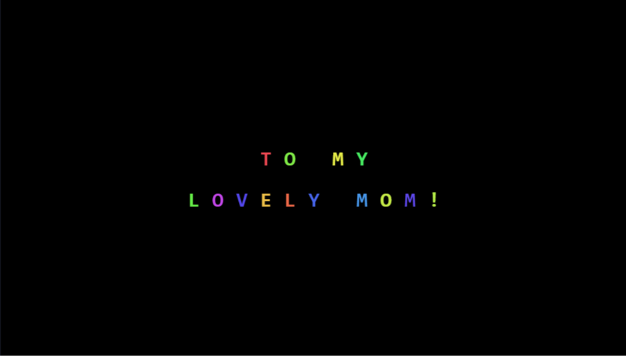

# 🎇 Mensagem Animada com Fogos - "Mother's Day"

Bem-vindo ao código do meu projeto de Animação de Texto! 🎇 Este é um projeto de Codificação Criativa (Creative Coding) focado em manipular o HTML5 Canvas para criar uma experiência visual mágica, onde fogos de artifício se transformam em palavras e balões flutuantes.

## 🚀 Sobre o Projeto

Um projeto visual e matemático construído totalmente do zero usando JavaScript puro e o poder de renderização do elemento Canvas[cite: 10, 12]. O grande diferencial deste código é a sua complexa lógica de "Máquina de Estados" orientada a objetos, onde cada letra possui física, tempo de vida e transformações independentes[cite: 10].

## ✨ Funcionalidades Principais

* **Máquina de Estados (State Machine):** Cada letra passa por um ciclo de vida meticulosamente programado: lançamento (`firework`), explosão/leitura (`contemplate`), inflar balão (`balloon`) e flutuar até sumir da tela (`done`)[cite: 10].
* **Física de Partículas:** O sistema calcula gravidade (`opts.gravity`), velocidade e movimentos harmônicos (usando `Math.sin`) para simular o lançamento e a explosão realista dos fragmentos dos fogos[cite: 10].
* **Sequenciador de Textos:** O script lê uma sequência (Array) de frases ("HAPPY", "MOTHER DAY", "TO MY", "LOVELY MOM!"), aplicando tempos de espera e atrasos de surgimento personalizados para cada linha[cite: 10].
* **Desenho Procedural Avançado:** Os balões, barbantes e fragmentos brilhantes não são imagens; eles são desenhados em tempo real utilizando matemática pura, como curvas de Bézier (`bezierCurveTo`) e arcos geométricos (`arc` e `ellipse`) no Canvas[cite: 10].
* **Cores Dinâmicas:** Uso do espectro de cores HSL (`hsl`) gerado aleatoriamente para cada letra, criando um visual colorido e vibrante que se destaca no fundo preto absoluto definido no CSS[cite: 10, 11].

## 🛠️ Tecnologias Utilizadas

* **HTML5:** Estruturação básica do documento e instanciação do elemento `<canvas>` que cobre toda a tela[cite: 12].
* **CSS3:** Reset de margens, ocultação de barras de rolagem (`overflow: hidden`) e estilização para garantir que o projeto ocupe 100% da viewport (tamanho da tela)[cite: 11].
* **JavaScript puro (Vanilla):** Utilização da API Canvas 2D, Orientação a Objetos (via prototypes para as Classes `Letter` e `Shard`) e `requestAnimationFrame` para manter o loop de animação contínuo e fluído[cite: 10].

## 📂 Estrutura de Arquivos

* `index.html` - A estrutura da página e o invólucro do Canvas.
* `style.css` - Contém as regras de reset e dimensionamento da tela preta.
* `script.js` - O motor de física, sequenciamento de texto e desenhos complexos.
* `Master.png` - Imagem de demonstração (preview) deste README.

## 🚀 Como Executar

1. Faça o download ou clone este repositório.
2. Dê um duplo clique no arquivo `index.html` para abri-lo em qualquer navegador web moderno.
3. Não é necessário clicar em nada; basta assistir à bela sequência de fogos se transformando na mensagem animada!
