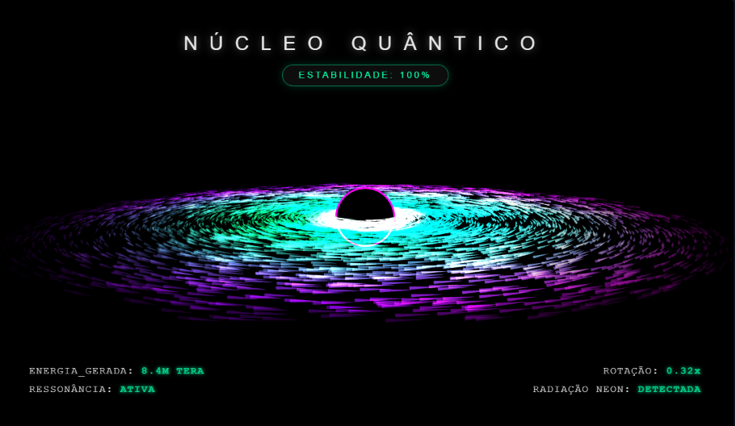

# 🌌 Núcleo Quântico 3D - Simulador WebGL

Bem-vindo ao código do projeto Núcleo Quântico 3D! 🌌 Este é um projeto de Codificação Criativa (Creative Coding) focado em simular um buraco negro dinâmico circundado por um disco de acreção em tempo real, combinando programação na GPU e animações rítmicas.

## 🚀 Sobre o Projeto

Um simulador visual interativo rodando inteiramente no navegador, construído com a biblioteca gráfica Three.js e programação direta em GLSL[cite: 16]. O projeto cria a ilusão de um núcleo de energia cujas propriedades físicas e visuais evoluem autonomamente através de transições suaves de estado, coreografadas perfeitamente pela biblioteca de animação GSAP[cite: 16].

## ✨ Funcionalidades Principais

* **Física Orbital e Efeito Doppler:** O `ShaderMaterial` do disco calcula a velocidade orbital das partículas baseado na distância até o centro (`1.5 / sqrt(rOriginal)`)[cite: 16]. Além disso, aplica um efeito Doppler que altera o brilho dependendo do ângulo de visão da câmera em relação à órbita (`dot(orbitDir, viewDir)`)[cite: 16].
* **Geometria Instanciada (Alta Performance):** Para garantir fluidez, o projeto renderiza 6.000 partículas simultâneas utilizando `InstancedMesh` a partir de uma geometria cilíndrica muito leve (`CylinderGeometry`)[cite: 16].
* **Distorção por Ruído (Simplex Noise):** O vertex shader integra funções matemáticas de ruído 3D (`snoise`) para gerar ondulações orgânicas e perturbações verticais dinâmicas no disco de acreção ao longo do tempo (`morphedWorldPos.y += noise`)[cite: 16].
* **Paleta Cyberpunk Dinâmica:** As cores transitam nativamente dentro do código da GPU, evoluindo de bordas roxas (`vec3(0.5, 0.0, 0.8)`), passando por verde esmeralda, até um núcleo ciano brilhante (`vec3(0.8, 1.0, 1.0)`)[cite: 16].
* **Máquina de Estados Automatizada:** Um loop temporal altera a anomalia a cada 9 segundos, alternando entre "Núcleo Quântico", "Perturbação Magnética" e "Sobrecarga de Energia"[cite: 16]. A biblioteca GSAP entra em ação para animar as propriedades do Shader (compressão, intensidade, morfologia) e o zoom da câmera de forma ultra-suave[cite: 16].
* **HUD Sci-Fi Imersiva:** A interface translúcida (`#overlay`) possui letreiros e pílulas de status neon que são atualizados dinamicamente pelo JavaScript, sincronizando as informações exibidas na tela com a mudança de comportamento do núcleo 3D[cite: 16].

## 🛠️ Tecnologias Utilizadas

* **HTML5 & CSS3:** Fornecem a marcação do Heads-Up Display (HUD), o efeito sombreado nas bordas (`#vignette`) e garantem uma experiência cinematográfica ocultando o ponteiro do mouse (`cursor: none`)[cite: 16].
* **JavaScript & Three.js (v0.170.0):** Gerenciam todo o contexto WebGL, controlam a criação do instanciamento geométrico, os materiais, a câmera dinâmica e a interação do usuário (via `OrbitControls`)[cite: 16].
* **GLSL (Shaders):** Código injetado que roda diretamente na placa de vídeo, garantindo cálculos complexos de trigonometria e ruído em milhares de instâncias sem travar o navegador[cite: 16].
* **GSAP:** Motor profissional de interpolação usado para coordenar as transições complexas nas variáveis de ambiente do WebGL e nas tags HTML simultaneamente[cite: 16].

## 📂 Estrutura de Arquivos

* `index.html` - Arquivo consolidado e autossuficiente que abriga a importação de dependências via `importmap`, os estilos da HUD e todo o motor gráfico e lógico escrito em JavaScript[cite: 16].
* `image_51c45c.png` - Imagem oficial de demonstração (preview) deste README.

## 🚀 Como Executar

1. Faça o download ou clone este repositório.
2. Como o código utiliza recursos de módulos JavaScript modernos (`type="module"` e `importmap`), é imprescindível executar o arquivo HTML utilizando um servidor local (como a extensão "Live Server" do VSCode) para evitar o bloqueio de CORS do navegador[cite: 16].
3. Arraste o mouse pela tela para visualizar o núcleo de diferentes ângulos usando a câmera orbital.
4. Solte o mouse, aguarde e deixe a simulação te guiar através dos diferentes estados quânticos programados!
