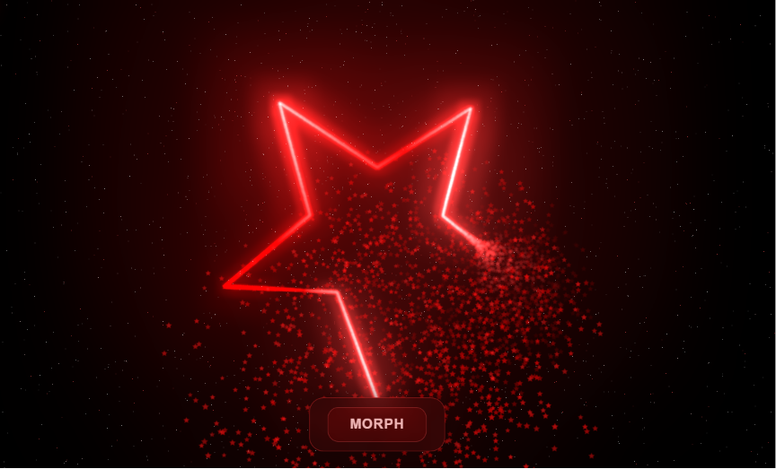

# ✨ Metamorfose de Partículas - Star to Heart Morph

Bem-vindo ao código do projeto Metamorfose de Partículas! ✨ Este é um projeto avançado de Codificação Criativa (Creative Coding) que cria um espetáculo visual dinâmico combinando geometria, física e pós-processamento utilizando WebGL.

## 🚀 Sobre o Projeto

Uma animação 3D interativa desenvolvida em um único arquivo com a biblioteca Three.js[cite: 31]. O projeto simula 10.000 partículas luminosas que transitam suavemente entre o formato de uma estrela de cinco pontas e um coração, incluindo um sistema contínuo de desintegração e reagrupamento orgânico ao longo do tempo[cite: 31].

## ✨ Funcionalidades Principais

* **Morphing Interativo:** Um botão 'MORPH' na interface controla a transição fluida das partículas entre as equações paramétricas da estrela (`createStarPath`) e do coração (`createHeartPath`) utilizando interpolação matemática (`THREE.MathUtils.lerp`)[cite: 31].
* **Efeito de Desintegração:** As partículas obedecem a um ciclo de dispersão programado, onde periodicamente se afastam de suas posições originais com base em compensações esféricas (`disintegrationOffsets`) e depois retornam, simulando uma poeira cósmica ao vento[cite: 31].
* **Textura e Brilho Procedurais:** Em vez de carregar arquivos de imagem externos, o projeto desenha sua própria textura de estrela diretamente no Canvas para as partículas (`createParticleTexture`) e aplica um efeito de brilho neon intenso através de pós-processamento com o `UnrealBloomPass`[cite: 31].
* **Cursor Personalizado Luminous:** O cursor padrão do mouse é ocultado e substituído por uma orbe de luz vermelha (`#custom-cursor`) que interage dinamicamente, expandindo-se e mudando de cor ao passar sobre o botão de controle[cite: 31].
* **Atmosfera Cósmica Profunda:** O fundo espacial imersivo combina uma nebulosa gerada via CSS (`radial-gradient` com `mix-blend-mode`) e um campo estelar 3D rotativo contendo 8.000 estrelas pontuais (`createStarfield`)[cite: 31].

## 🛠️ Tecnologias Utilizadas

* **HTML5 & CSS3:** Fornecem a estrutura da interface de usuário translúcida (usando `backdrop-filter: blur`), a criação da nebulosa de fundo, a sobreposição das camadas de visualização e as interações do cursor do mouse[cite: 31].
* **JavaScript (ES Modules):** A lógica principal que executa cálculos matemáticos de movimento, os ciclos de variação de tamanho e brilho das partículas ao longo do tempo (`time`), e a escuta de eventos como redimensionamento de janela e controle do mouse[cite: 31].
* **Three.js (v0.162.0):** Biblioteca gráfica WebGL que instancia a câmera (`PerspectiveCamera`), a manipulação interativa da cena (`OrbitControls`), a renderização com dezenas de milhares de vértices usando `BufferGeometry`, e a cadeia de pós-processamento (`EffectComposer`)[cite: 31].

## 📂 Estrutura de Arquivos

* `index.html` - Arquivo centralizado contendo todo o CSS embutido, a configuração do mapa de importação (`importmap`) para o Three.js e a lógica matemática completa do espetáculo de partículas[cite: 31].
* `Captura de tela 2026-08-10 093950.png` - Imagem de demonstração (preview) deste README.

## 🚀 Como Executar

1. Faça o download ou clone este repositório.
2. Como o código utiliza importação de módulos do ES6 (`type="module"`), o arquivo não pode ser aberto diretamente dando dois cliques. Utilize um servidor local (como a extensão "Live Server" do Visual Studio Code) para rodar o `index.html`[cite: 31].
3. Arraste o mouse na tela preta para orbitar e navegar pela câmera 3D pelo cenário.
4. Clique no botão "MORPH" no final da tela para acionar a transformação mágica entre a Estrela e o Coração!
