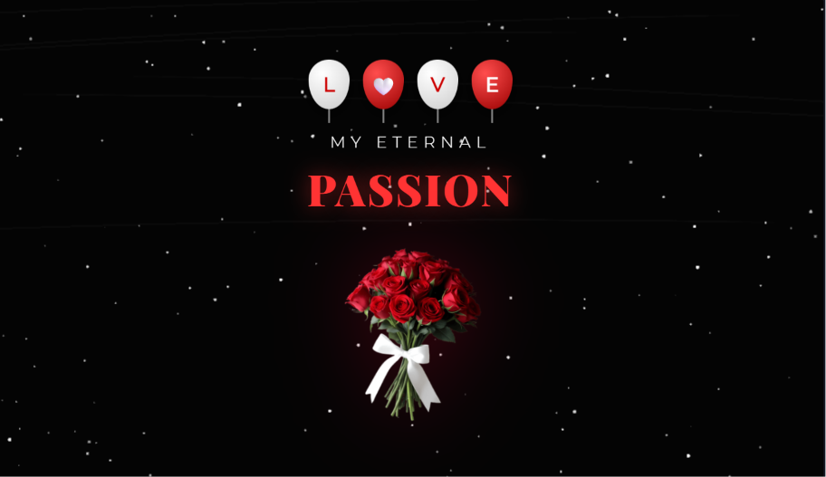

# 🌹 Cartão Interativo - "My Eternal Passion"

Bem-vindo ao código do projeto Cartão Interativo! 🌹 Este é um projeto de Codificação Criativa focado em criar uma experiência visual relaxante e romântica, ideal para homenagens ou presentes digitais.

## 🚀 Sobre o Projeto

Um projeto interativo construído do zero, combinando manipulação de elementos HTML e CSS com animações avançadas em Canvas para o fundo dinâmico[cite: 18, 19, 20]. O destaque fica para a sincronia do efeito de digitação automática, os balões flutuantes e o sistema de fogos de artifício ativados pelo usuário[cite: 19, 20].

## ✨ Funcionalidades Principais

* **Efeito Máquina de Escrever:** Um script controla o surgimento progressivo das palavras "MY ETERNAL" seguido por "PASSION" com intervalos de tempo perfeitamente calculados (`typeWriter`)[cite: 19].
* **Fogos de Artifício Interativos:** Ao clicar com o mouse ou tocar na tela (em dispositivos móveis), uma sequência de fogos de artifício é disparada (`launchFireworkSequence`), explodindo com física de gravidade e atrito nas partículas[cite: 19].
* **Céu Noturno Dinâmico:** O fundo em Canvas renderiza 150 estrelas cintilantes que alteram sua opacidade continuamente, além de gerar estrelas cadentes aleatórias (`ShootingStarBg`) que cruzam a tela deixando rastros[cite: 19].
* **Balões Flutuantes:** Elementos HTML que soletram "L 🤍 V E", estilizados com `radial-gradient` para simular volume e flutuando em tempos diferentes usando `@keyframes float` no CSS[cite: 18, 20].
* **Buquê Pulsante e Texto Glow:** A imagem central do buquê de rosas possui uma animação contínua e suave de pulsação de escala (`@keyframes pulse`), enquanto a tipografia principal brilha em tons avermelhados com `text-shadow`[cite: 20].
* **Cursor Personalizado:** O ponteiro padrão do mouse é substituído por um emoji de rosa (🌹) usando um SVG embutido diretamente no CSS da página[cite: 20].

## 🛠️ Tecnologias Utilizadas

* **HTML5:** Estruturação semântica do conteúdo, importação de fontes do Google (Montserrat e Playfair Display) e integração da tag `<canvas>`[cite: 18].
* **CSS3:** Estilização de layout, gradientes esféricos, sombras radiantes e animações de estado para criar movimento e volume[cite: 20].
* **JavaScript puro:** Motor por trás da renderização 2D do céu estrelado, lógica orientada a objetos (Classes `Firework` e `Particle`) para criar as explosões e temporizadores de texto[cite: 19].

## 📂 Estrutura de Arquivos

* `index.html` - A estrutura principal da página e integração de scripts/estilos[cite: 18].
* `style.css` - Contém todas as regras de estilo, cursores e animações visuais[cite: 20].
* `script.js` - O motor em JavaScript para o Canvas e interatividade[cite: 19].
* `rosa.png` - Imagem de demonstração e decoração central do projeto.

## 🚀 Como Executar

1. Faça o download ou clone este repositório.
2. Certifique-se de que a imagem `rosa.png` está na mesma pasta dos arquivos de código.
3. Dê um duplo clique no arquivo `index.html` para abri-lo em qualquer navegador web moderno.
4. Clique na tela escura para soltar os fogos de artifício!
