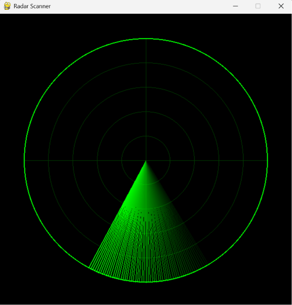

# 📡 Scanner de Radar - Simulação Pygame

Bem-vindo ao código do Scanner de Radar! 📡 Este é um projeto visual construído para simular a interface clássica de um radar ou sonar varrendo o perímetro e detectando alvos.

## 🚀 Sobre o Projeto

Uma simulação gráfica contínua escrita inteiramente em Python utilizando a biblioteca Pygame[cite: 15]. O projeto desenha uma interface tática com grade polar e calcula interseções geométricas em tempo real para iluminar pontos (inimigos) ocultos no mapa quando a linha de varredura passa por eles[cite: 15].

## ✨ Funcionalidades Principais

* **Grade do Radar:** Desenha círculos concêntricos (com passos de 50 pixels) e linhas axiais cruzadas em um tom de verde escuro `(0, 60, 0)` para criar a base do monitor[cite: 15].
* **Animação de Varredura (Sweep):** Utiliza uma superfície com suporte a transparência (`pygame.SRCALPHA`) para desenhar 60 linhas radiais[cite: 15]. A opacidade (`alpha`) de cada linha diminui gradualmente, gerando o icônico efeito visual de rastro de luz rodando pela tela[cite: 15].
* **Geração Aleatória de Alvos:** O sistema posiciona 5 "inimigos" ocultos no mapa, calculando suas coordenadas exatas (X e Y) através de distâncias e ângulos aleatórios usando as funções matemáticas `math.cos` e `math.sin`[cite: 15].
* **Detecção Angular:** A cada quadro, o script compara o ângulo atual da varredura com o ângulo em que cada alvo se encontra[cite: 15]. Se a diferença for menor que 2 graus (ou maior que 358), o alvo é "detectado" e sua opacidade vai instantaneamente para o máximo (255)[cite: 15].
* **Efeito de Desvanecimento:** Após serem iluminados, os pontos não somem de imediato; eles desaparecem suavemente no escuro, tendo sua opacidade reduzida constantemente a cada quadro da animação[cite: 15].
* **Alta Fluidez:** O loop principal é travado e otimizado para rodar a suaves 60 quadros por segundo utilizando o `clock.tick(60)`[cite: 15].

## 🛠️ Tecnologias Utilizadas

* **Python:** Linguagem base gerenciando os loops de atualização e as listas de dicionários que armazenam os dados dos alvos[cite: 15].
* **Pygame:** Biblioteca central responsável pela criação da janela de 600x600 pixels, desenho das formas geométricas (`pygame.draw.circle`, `pygame.draw.line`) e manipulação de canais alfa (transparência)[cite: 15].
* **Módulo Math:** Biblioteca nativa do Python, essencial para a conversão de graus em radianos e cálculos trigonométricos de posicionamento espacial 2D[cite: 15].
* **Módulo Random:** Utilizado para espalhar os alvos de forma imprevisível e dinâmica a cada nova execução do programa[cite: 15].

## 📂 Estrutura de Arquivos

* `main.py` - O arquivo principal contendo todo o script Python e a lógica de renderização gráfica.
* `Radar.png` - Imagem de demonstração (preview) deste README.

## 🚀 Como Executar

1. Certifique-se de ter o **Python** instalado na sua máquina.
2. Você precisará da biblioteca gráfica Pygame. Abra o terminal ou prompt de comando e digite: `pip install pygame`
3. Faça o download ou clone este repositório.
4. Execute o script com o comando: `python main.py`
5. Acompanhe a varredura verde localizando os alvos escondidos na escuridão!
