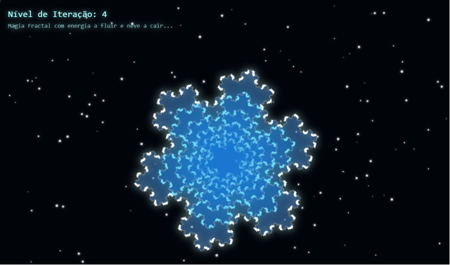

# ❄️ Floco de Neve Fractal Animado - Magia em Canvas

Bem-vindo ao código do Floco de Neve Fractal! ❄️ Este é um projeto de Codificação Criativa (Creative Coding) focado em matemática pura e renderização visual, criando uma experiência hipnotizante baseada na famosa Curva de Koch.

## 🚀 Sobre o Projeto

Um espetáculo visual gerado inteiramente por código, utilizando a API do HTML5 Canvas e JavaScript puro[cite: 24]. O projeto demonstra o poder da recursividade matemática combinada com animações fluidas para criar um fractal que "respira" (cresce e diminui continuamente) em um cenário de inverno dinâmico[cite: 24].

## ✨ Funcionalidades Principais

* **Matemática Fractal (Curva de Koch):** O floco de neve é gerado através de um algoritmo recursivo que desenha a clássica Curva de Koch, subdividindo as linhas de um triângulo base em segmentos menores de forma iterativa[cite: 24].
* **Animação de Crescimento Suave:** O fractal não apenas "pula" de um nível para outro; ele usa funções trigonométricas (`Math.sin`) combinadas com o tempo para calcular frações de crescimento (`fraction`), criando uma transição orgânica e fluida entre as iterações[cite: 24].
* **Efeito de Profundidade e Escala:** O código desenha 6 camadas sobrepostas (`numLayers`), onde cada camada interna é rotacionada, escalonada em tamanho e pintada com diferentes tons e opacidades de azul e branco translúcido[cite: 24].
* **Fluxo de Energia (Dash Animation):** O contorno do fractal utiliza o tracejado do Canvas (`setLineDash`) animado dinamicamente através da propriedade `lineDashOffset`, criando a ilusão de pura energia percorrendo o floco de neve[cite: 24].
* **Sistema de Partículas (Neve):** Um fundo imersivo com 150 flocos de neve independentes (`numFlakes`) dotados de raios, velocidades e quedas aleatórias que reiniciam em loop perfeito ao saírem da tela[cite: 24].
* **Interface Dinâmica HUD:** Uma sobreposição limpa em HTML indica em tempo real o "Nível de Iteração" atual (variando conforme a animação avança), com efeitos de brilho neon no texto[cite: 24].

## 🛠️ Tecnologias Utilizadas

* **HTML5 Canvas:** Utilizado para a renderização 2D de alta performance do fractal, das camadas de luz e das partículas de neve[cite: 24].
* **CSS3:** Responsável pela formatação da tela, remoção de margens e barras de rolagem (`overflow: hidden`), e o efeito de brilho (`text-shadow`) do painel de informações[cite: 24].
* **JavaScript puro (Vanilla):** O verdadeiro motor lógico do projeto. Gerencia o loop da animação (`requestAnimationFrame`), os cálculos de geometria complexa (`Math.atan2`, `Math.cos`, `Math.sin`) e a função recursiva de desenho do fractal[cite: 24].

## 📂 Estrutura de Arquivos

* `index.html` - Arquivo único consolidado contendo a estrutura base, todo o CSS (na tag `<style>`) e a lógica completa em JavaScript (na tag `<script>`)[cite: 24].
* `Snow-Flake.png` - Imagem de demonstração (preview) deste README.

## 🚀 Como Executar

1. Faça o download ou clone este repositório.
2. Dê um duplo clique no arquivo `index.html` para abri-lo em qualquer navegador web moderno.
3. Não é preciso instalar nada, apenas observe a magia geométrica se construindo automaticamente!
