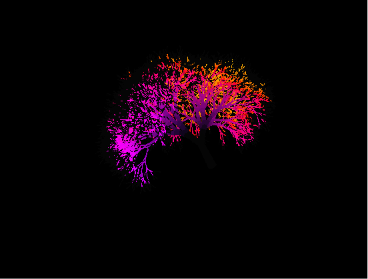

# 🌳 Árvore Fractal 3D - Cores Puras

Bem-vindo ao código do meu projeto da Árvore Fractal! 🌳 Este é um projeto de Codificação Criativa focado em criar uma experiência visual imersiva e hipnotizante no navegador.

## 🚀 Sobre o Projeto

Um projeto avançado de renderização 3D em tempo real, combinando a geração procedural de geometria geométrica com algoritmos matemáticos e efeitos de pós-processamento[cite: 27]. O destaque fica para a construção da árvore usando L-Systems e o desenvolvimento de um material customizado (Shader) que faz a luz pulsar e fluir pelos galhos[cite: 27].

## ✨ Funcionalidades Principais

* **Geração Procedural (L-System):** A estrutura orgânica da árvore é construída algoritmicamente usando um axioma inicial e regras de substituição iteradas 14 vezes, traduzidas dinamicamente para cilindros 3D[cite: 27].
* **Material Customizado (Shaders em GLSL):** Utiliza shaders de vértice e fragmento injetados diretamente no código para calcular um fluxo de luz (pulse) que percorre os galhos da base até as pontas, guiado pelo tempo (`uTime`)[cite: 27].
* **Cores HSL Vibrantes e Puras:** A coloração neon é calculada internamente no shader, convertendo valores de matiz (hue) para RGB com 100% de saturação e brilho exato, garantindo cores vivas que não esbranquiçam[cite: 27].
* **Pós-processamento e Brilho (Bloom):** Implementação do `UnrealBloomPass` através do `EffectComposer` para adicionar um brilho atmosférico (glow) sobre a geometria iluminada[cite: 27].
* **Animação Contínua e Orgânica:** A árvore inteira rotaciona de forma fluida e hipnotizante nos eixos X, Y e Z utilizando funções trigonométricas (`Math.sin` e `Math.cos`)[cite: 27].
* **Interatividade de Câmera e Cor:** O usuário pode navegar livremente pelo cenário 3D (graças ao `OrbitControls`) e, ao clicar na tela, a paleta de cores da árvore é alterada instantaneamente[cite: 27].

## 🛠️ Tecnologias Utilizadas

* **HTML5 & CSS3:** Estrutura básica e reset de margens para garantir que o renderizador ocupe 100% da tela sobre um fundo preto absoluto[cite: 27].
* **JavaScript (ES Modules):** A linguagem central que gerencia as matrizes matemáticas, arrays de geometria e as interações do mouse[cite: 27].
* **Three.js (v0.162.0):** Poderosa biblioteca WebGL responsável por toda a criação da cena 3D, câmera, renderização e processamento dos efeitos visuais (`EffectComposer`)[cite: 27].

## 📂 Estrutura de Arquivos

* `index.html` - Arquivo consolidado que contém a importação do Three.js, os shaders GLSL e toda a lógica de construção e renderização do projeto.
* `Captura de tela 2026-08-10 084407.png` - Imagem de demonstração do README.

## 🚀 Como Executar

1. Faça o download ou clone este repositório.
2. Devido à importação de módulos do Three.js via `importmap`, é recomendado rodar o projeto através de um servidor local (como o "Live Server" do VSCode) para evitar bloqueios de CORS do navegador.
3. Arraste o mouse pela tela para rotacionar a árvore em 360º.
4. Clique em qualquer lugar da tela para mudar as cores luminosas!
